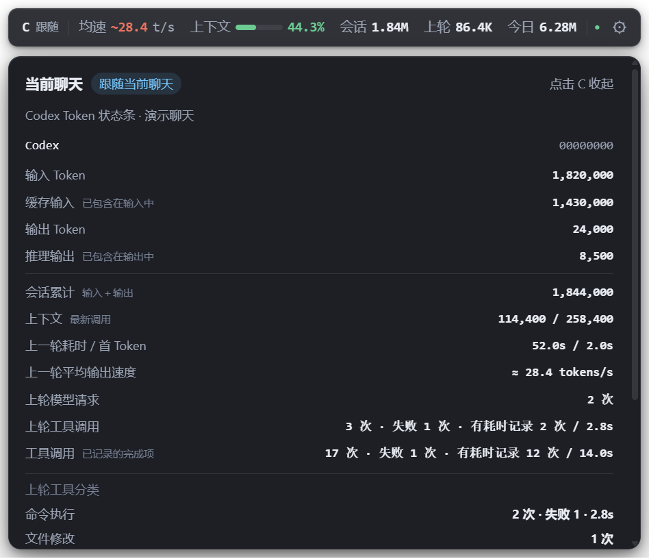

# Codex Token 状态条（Windows）

为 Codex 桌面版提供一个跟随窗口的独立浮条。基于
[zcode-token-usage-statusbar](https://github.com/xhwxt/zcode-token-usage-statusbar)
的胶囊、进度条和明细面板样式适配，读取本机 Codex 日志。


<details>
<summary>查看明细面板（模拟数据）</summary>



</details>

## 开始使用

从 [GitHub Releases](https://github.com/3ALLBUY14/codex-token-statusbar/releases/latest) 下载 `CodexTokenStatusbar-0.4.4-Windows-x64.zip`。

安装版：解压整个压缩包，双击 **`安装.cmd`**，选择是否开机启动和创建桌面入口，再点击“安装并启动”。安装到当前用户目录，无需管理员权限。可在 Windows“设置 → 应用”中卸载。

便携版：双击安装包 `app` 目录中的 **`CodexTokenStatusbar.exe`**。
无需安装 Node.js、Python 或 .NET。

1. 打开 Codex 桌面版，进入一个有模型响应记录的聊天。
2. 浮条默认出现在窗口右上方；切换到其他应用时自动隐藏。
3. 鼠标进入浮条时自动半透明避让，移开后恢复；点击左侧 **C / 跟随** 展开明细，再点 C 收起。悬停与移开均不改变明细状态。
4. 点击 **⚙** 调整显示项、主题、大小、位置，或者锁定一个聊天。勾选“允许自由拖动浮条”后，拖动指标或空白处移动浮条，松开后保存位置；C 和设置按钮保持可点击。
5. 托盘图标右键可以刷新、显示/隐藏、设置或退出。托盘图标可能在 `^` 内。
6. 设置中的“隐藏浮条文字”可隐藏指标名称和跟随状态，保留数值、进度条及操作按钮；明细文字仍完整显示。
7. 浮条找不到时，重新启动桌面入口，并在设置或托盘菜单中点击“恢复浮条位置”。
8. 设置页的“运行诊断”显示聊天连接、窗口跟随、浮条可见性和日志读取状态，便于定位升级后浮条不出现的问题。
9. 窄窗口或高缩放下，浮条用 `+N` 表示收纳的指标；点击 C 可在明细中查看全部收纳项。窗口跟随助手每两秒报告一次状态，设置页显示最后响应时间，超时后自动重启。

安装时可以选择登录 Windows 自动启动，也可重新安装取消该选项。更新安装版会保留显示偏好和快捷方式选项；安装器先校验暂存副本，再替换旧版，安装失败时恢复旧版。旧便携版需要先从托盘退出。偏好设置保存在
`%APPDATA%\CodexTokenStatusbar\settings.json`，需要彻底清除时可自行删除该目录。

## 指标

| 指标 | 口径 |
| --- | --- |
| 会话 Token | 当前聊天的累计输入＋输出；缓存输入属于输入，推理输出属于输出，均不重复累加 |
| 本轮 / 上轮 Token | 当前轮次或最近已完成轮次的累计用量变化；可能含多次模型调用 |
| 上下文 | 最新 `last_token_usage.total_tokens` / `model_context_window`，随新日志更新；不是会话累计 Token |
| 平均输出速度 | 最近已完成轮次的输出 Token /（`duration_ms` − `time_to_first_token_ms`），单位 tokens/s |
| 缓存命中率 | 会话累计缓存输入 / 会话累计输入 |
| 今日 Token | 本机日历日期内，各聊天日志累计用量的正向增量；所有已发现本地聊天均纳入，不限当前聊天 |
| 工具调用 | 当前聊天日志中已完成的命令执行、文件修改、扩展操作和图像查看次数；失败数按结构化状态统计，有耗时记录的项目合计耗时 |

点击 C 的明细还显示本轮或上一轮的模型请求数，以及该轮工具调用次数、失败数、可用耗时和按类别分组。会话工具累计与轮次工具统计分别展示。

上下文进度根据窗口容量提示：小于 100 万 Token 的窗口从 70% 显示黄色、85% 显示红色；100 万及以上窗口从 40% 显示黄色、60% 显示红色。明细会说明预警，只有日志明确报告上下文超限时才显示“超限”。这些阈值是提前提醒，不代表模型此时必然无法继续。

工具耗时只累计日志提供耗时的项目；明细会同时列出有耗时记录的次数。无该字段的调用仍计入总次数，不补估耗时。统计只读取结构化的项目类别、状态和时长，不保存调用参数或结果正文。

**平均输出速度不等于纯模型解码速度。**它包含推理输出、工具执行、等待和多次
模型请求的时间；标记为 `均速 ~xx.x t/s`。缺少首 Token 时间时使用整轮耗时；
缺少输出 Token 或有效耗时时显示 `—`。运行新一轮时保留上轮速度，活动点呈蓝色。
中断、失败或计数回退后不显示旧速度。
续接日志带入历史累计用量时，从首条请求用量推算初始基线，并在明细中标记估算；
缺少可用基线时不显示首轮速度。历史累计也不会整笔计入今日新增用量。

统计反映本地日志，不是账单或套餐额度。今日按 Windows 的当前本地日期归属；旧日志缺失、删除日志、不同电脑的聊天以及没有保存日志的调用无法重建。
计数回退、超大记录、读取错误或初始索引未完成时，今日值会标为 `≈`。

## 当前聊天如何识别

- 根据 Codex 主窗口所属进程，读取该进程的本地桌面日志中的 `ownerRoutePath` 页面切换记录；约每 250 毫秒检查增量记录，切换已缓存的旧聊天也不依赖新消息或 Token 更新。
- 页面路径缺失或停留在旧聊天时，以 Windows UI Automation 读取前台 Codex 窗口的文档标题，每约 750 毫秒检查一次；与本机 `session_index.jsonl` 中的标题精确匹配，唯一匹配时跟随该聊天。路径与标题相符时优先使用聊天 ID；不同结果会结合更新时间处理。
- 连接本机 `\\.\pipe\codex-ipc` 监测连接与消息流订阅。一个窗口可同时订阅多个后台聊天，因此订阅顺序不再用作当前页面的判断依据。
- 按聊天 ID 选择对应日志，包括切换到没有正在运行的旧聊天。
- 新聊天没有日志或用量时显示 `—`，不沿用上一聊天的数据。
- 路径与标题都无法识别时明确标记为 **最近**，显示最近活跃的桌面聊天；可在设置中手动锁定。已识别为首页、新聊天或尚未进入索引的聊天时清空聊天指标，显示“暂无”，不会沿用上一聊天的数据。
- 多个窗口的路径无法可靠对应到前台 HWND 时，尝试前台文档标题；标题重名且无可靠 ID 时显示 **待选**，请在设置中手动锁定聊天。
- 明细显示已选聊天的标题；设置中的运行诊断显示识别方式，便于确认正在使用路径、标题或手动锁定。
- 兼容独立 `Codex.exe` 和当前 `OpenAI.Codex` 安装包内的 `ChatGPT.exe`。

桌面日志、IPC 与 JSONL 格式是版本敏感的内部接口，桌面客户端升级可能需要更新适配。
本版针对 Windows 10/11 x64，已验证 Codex Desktop 26.930.2377.0 的本机连接、当前聊天识别和窗口识别；未验证 Windows ARM64、macOS 或 Linux。

## 本地数据与权限

读取 `CODEX_HOME` 指定目录，默认 `~/.codex` 下的 `sessions/**/*.jsonl` 和
`archived_sessions/**/*.jsonl`。只提取用量、时间、模型、工具状态和聊天元数据；不读取 `auth.json`，
不写入 Codex 日志，不持久化聊天正文。没有遥测、模型请求或运行时网络访问。
另外只读本机 `Codex/Logs` 或 MSIX 包的 `LocalCache/Local/Codex/Logs` 下的桌面日志，仅提取当前进程的页面路径、窗口标识和时间；不复制或保存桌面日志正文。读取 `session_index.jsonl` 中的聊天 ID 和标题，并通过 Windows UI Automation 读取前台 Codex 窗口的文档标题，用于本机识别和展示。
聊天 ID 仅用于本机绑定和选择；偏好设置可保存用户主动锁定的聊天 ID。

浮条是独立窗口；原项目的 ZCode 安装器和注入 loader 不会执行。

Windows 窗口跟随通过随包的 PowerShell / Win32 小助手实现，不弹控制台窗口。
受企业策略限制无法运行 PowerShell 时，窗口跟随可能不可用；可以在设置中启用
“切换到其他应用时仍显示”作为固定桌面浮条。

## 从源码运行

要求 Node.js 22.12+，首次安装需要联网下载依赖和 Electron。

```powershell
npm ci
npm start
```

检查统计、IPC 和解析回归：

```powershell
npm test
npm run diagnose
```

`diagnose` 仅输出数值、绑定状态与读取健康信息，不输出聊天内容、ID 或用户路径。

生成仅使用模拟数据的界面截图并做真实本机只读连接检查：

```powershell
.\node_modules\.bin\electron.cmd . --smoke
```

截图和报告位于 `artifacts/`。真实本机日志不会打包到便携版。
若正在操作鼠标，可追加 `--smoke-no-mouse` 跳过真实鼠标交互检查；界面、设置保存与本机连接检查仍会执行。

打包 Windows x64 便携目录：

```powershell
npm run package
```

再生成包含安装、卸载和 SHA256 校验文件的分享压缩包：

```powershell
npm run release
```

分享包位于 `release/`，不包含 `artifacts`、用户偏好、账号或聊天日志。
便携目录位于 `dist/CodexTokenStatusbar-win32-x64/`。请运行整个目录中的 `.exe`，
不要单独复制 `.exe`。便携版没有代码签名，Windows 可能显示未知发布者提示。

## 授权

MIT。保留的上游授权和实现来源见 [THIRD_PARTY_NOTICES.md](THIRD_PARTY_NOTICES.md)。这是社区项目，与 OpenAI 无隶属关系。

欢迎提交问题或改进，开发与反馈约定见 [CONTRIBUTING.md](CONTRIBUTING.md)，版本记录见 [CHANGELOG.md](CHANGELOG.md)。反馈截图请先遮挡聊天标题、内容及账号信息。
